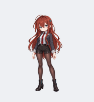

# Codex Anime Pets

**English** | [简体中文](README.zh-CN.md)

Four animated companions for Codex, with searchable bilingual metadata, saved generation prompts, and two ways to use them.

| Assistant-004 | Assistant-004 Anime | March 7th | Cirno |
| --- | --- | --- | --- |
|  |  |  |  |
| Original, ~3.5-head proportions | Original, ~5-head proportions | Unofficial fan art | Unofficial fan art |

## Download

[Latest release and SHA-256 checksums](https://github.com/David-Lzy/codex_anime_pets/releases/latest)

- **Codex-Anime-Pets.zip**: lightweight install bundle for the Codex pet picker. Includes v2 and v1 compatibility assets.
- **Assistant-004-Desktop-2.0.0-win-x64.zip**: independent Windows HD companion. **Unsigned**. Extract the whole ZIP, then double-click **Assistant-004 Desktop.exe**. No Python or Node installation required.
- Native source images, generation prompts and build code are in this repository. The Windows binary is built by GitHub Actions, not stored in Git history.

## Install Into Codex

Extract the pet bundle first. On Windows, double-click `scripts/install.bat` to install Assistant-004, or select a pet:

```powershell
powershell -ExecutionPolicy Bypass -File .\scripts\install.ps1 -PetId assistant-004-anime
powershell -ExecutionPolicy Bypass -File .\scripts\install.ps1 -All
```

On macOS/Linux (Python 3.9+):

```sh
sh scripts/install.sh --pet assistant-004
sh scripts/install.sh --all
```

Universal Python installer:

```sh
python scripts/install.py --list
python scripts/install.py --pet march-7th-001
```

Use `--legacy` with Python/Shell or `-Legacy` with PowerShell for older clients. The installer copies only `pet.json` and `spritesheet.webp` to `$CODEX_HOME/pets/<id>/`, falling back to `~/.codex/pets/<id>/`. Existing files are backed up under `pets/.backups/`. Refresh the pet picker or restart Codex if necessary. A compatible Codex desktop client is required; the shell installer does not itself provide that client.

Manual installation: copy those two files from the pet folder. For v1, copy the pair from its `compat/v1/` folder instead.

## Independent HD Desktop

The same four pets use true transparent **768x832** frames in an Electron/Canvas app. Default window height is 320 pixels. Drag to move; click to wave; double-click to hop. The native context/tray menu provides character, action, size, pause, pointer direction, click-through, task selection, position reset and exit.

Optional **Codex integration** backs up and merges observer hooks only after confirmation. It sends minimal status events to a token-protected loopback port. No prompts or tool output are transmitted, no approval decision is changed, and remote tasks are not automatically connected. Without integration, all actions remain available manually.

See [English desktop guide](desktop/README.md) for trust requirements, event limitations and builds. Windows binaries are unsigned. **macOS/Linux are source/build-instructions only, not hardware-validated.** No autostart is configured.

## Artwork And Animation

Each pet has nine action clips and 16 idle look directions, starting up and proceeding clockwise. Both Assistants wear a lab coat for working, review, frustration and waiting; other states use a casual short jacket. March 7th and Cirno retain their signature fan-art outfits.

The remaster uses native high-resolution green-screen pose drawings, locally matted into real RGBA. One common canvas scale is used; frames are translated onto a shared baseline, never independently enlarged to fill their bounding boxes. Jump crouches and airborne poses remain distinct drawings. Leftward movement mirrors the rightward cycle.

Codex v2: **1536x2288**, 8 columns by 11 rows, **192x208** per cell. v1 compatibility: **1536x1872**. These fixed-size Codex atlases are separate from HD playback; no client modification or custom Codex frame-rate behavior is promised. Earlier artwork remains in Git history.

## Find A Pet

- [Pet list](PETS.md)
- [Catalog](catalog.json)
- [AI retrieval index](indexes/ai-search-index.json)
- [Tag lookup](indexes/tags.json)
- [Catalog schema](schemas/catalog.schema.json)
- [Source and prompt notes](art/README.md)
- [Validation and remaining interactive checks](art/QA.md)
- [File hashes](manifest.json)

AI search example: "Find an original skeptical research-assistant Codex pet with HD animation." Searchable metadata helps retrieval; it does not guarantee inclusion in any search engine.

## Build And Contribute

Add a folder under `pets/<id>/`, metadata to `catalog.json`, artwork provenance and applicable rights notices. Then run `python scripts/build_index.py` and the checks in [the art guide](art/README.md). Keep fan assets clearly distinguished from original characters. The install bundle has its own subset manifest; the repository manifest covers public source files.

## Rights

Code and original project metadata are MIT-licensed. Fan characters and their franchise rights are **not granted by MIT**. March 7th and Cirno remain unofficial fan-made assets for non-commercial personal desktop use under the existing [NOTICE](NOTICE.md). Assistant-004 is an original design. User-supplied franchise reference attachments are not redistributed.
