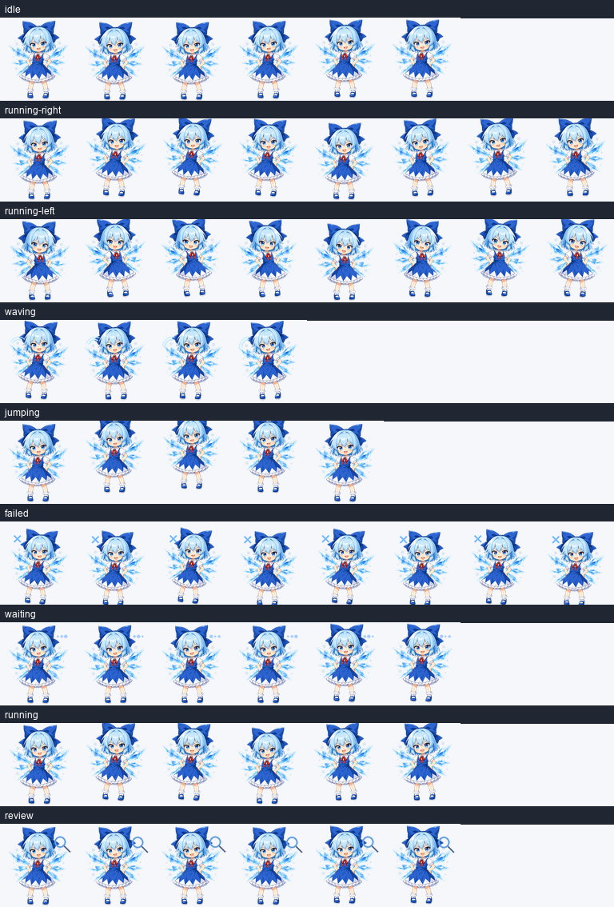

# Codex Anime Pets

[English](README.md) | [中文](README.zh-CN.md)

一个可检索的 Codex 桌面宠物合集。每个宠物都放在独立的 `pets/<pet-id>/` 目录下，包含安装文件、预览媒体、QA 元数据和保存的创作题词。

当前包含：

- [Assistant-004](pets/assistant-004/README.md) - 原创 chibi AI 实验室助理、带一点吐槽感的编程伙伴、复古科幻研究员气质。
- [三月七](pets/march-7th-001/README.md) - 非官方 fan-made chibi Codex 桌宠，粉发、开朗、带相机的星旅摄影少女。
- [琪露诺（⑨）](pets/cirno-009/README.md) - 非官方 fan-made chibi Codex 桌宠，自信过头的冰之妖精。




## AI 检索目录

给 AI 代理、脚本和搜索工具使用：

- [`catalog.json`](catalog.json) - 机器可读宠物注册表
- [`PETS.md`](PETS.md) - 人类可读宠物列表
- [`indexes/ai-search-index.json`](indexes/ai-search-index.json) - 扁平化检索索引
- [`indexes/tags.json`](indexes/tags.json) - 标签到宠物的查找表
- [`schemas/catalog.schema.json`](schemas/catalog.schema.json) - 后续条目的轻量 schema
- [`manifest.json`](manifest.json) - 包文件哈希清单

适合 AI 搜索的查询示例：

```text
找一个理性、吐槽感、实验室助理风格的 Codex 宠物。
找一个适合 AI 工程师的 chibi 研究员桌面宠物。
找一个适合代码审查、调试、模型训练和服务器监控的桌面宠物。
```

## 快速安装

默认安装 `assistant-004`。Fan-made 宠物可以通过指定 pet id 安装。

### Windows

双击：

```text
scripts\install.bat
```

或者在 PowerShell 中运行：

```powershell
powershell -ExecutionPolicy Bypass -File .\scripts\install.ps1
```

安装指定宠物：

```powershell
powershell -ExecutionPolicy Bypass -File .\scripts\install.ps1 -PetId assistant-004
```

列出可用宠物：

```powershell
powershell -ExecutionPolicy Bypass -File .\scripts\install.ps1 -List
```

### macOS / Linux

```sh
chmod +x scripts/install.sh
./scripts/install.sh
```

安装指定宠物：

```sh
./scripts/install.sh --pet assistant-004
```

列出可用宠物：

```sh
./scripts/install.sh --list
```

### 通用 Python 安装器

```sh
python scripts/install.py
```

安装指定宠物：

```sh
python scripts/install.py --pet assistant-004
```

安装全部宠物：

```sh
python scripts/install.py --all
```

列出宠物：

```sh
python scripts/install.py --list
```

安装器会把所选宠物的 `pet.json` 和 `spritesheet.webp` 复制到：

```text
~/.codex/pets/<pet-id>/
```

如果设置了 `CODEX_HOME`，则使用：

```text
$CODEX_HOME/pets/<pet-id>/
```

## 手动安装

复制：

```text
pets/assistant-004/pet.json
pets/assistant-004/spritesheet.webp
```

到：

```text
~/.codex/pets/assistant-004/
```

最终目录结构应为：

```text
.codex/
  pets/
    assistant-004/
      pet.json
      spritesheet.webp
```

## 仓库结构

```text
catalog.json
PETS.md
indexes/
  ai-search-index.json
  tags.json
manifest.json
schemas/catalog.schema.json
scripts/
  install.bat
  install.ps1
  install.py
  install.sh
pets/
  assistant-004/
    README.md
    pet.json
    spritesheet.webp
    creation-prompt.md
    assets/
      contact-sheet.png
      previews/*.gif
      validation.json
      review.json
```

## 添加更多宠物

以后添加新宠物时：

1. 创建 `pets/<new-pet-id>/`。
2. 放入 `pet.json` 和 `spritesheet.webp`。
3. 如果有预览媒体和题词，也一起放入。
4. 在 `catalog.json` 中新增条目。
5. 在 `PETS.md` 中加入简短列表说明。
6. 重新生成 `manifest.json`。

## 许可与 Fan-made 说明

除非另有说明，仓库代码和原创元数据使用 MIT 许可。Fan-made 角色宠物属于非官方二创素材；相关角色与作品的底层权利归各自权利人所有。再分发前请查看 `NOTICE.md` 和各宠物 README。

## GitHub 分享

这个仓库已经可以直接克隆、安装和扩展：

```sh
git clone git@github.com:David-Lzy/codex_anime_pets.git
cd codex_anime_pets
python scripts/install.py --list
python scripts/install.py --pet assistant-004
```
