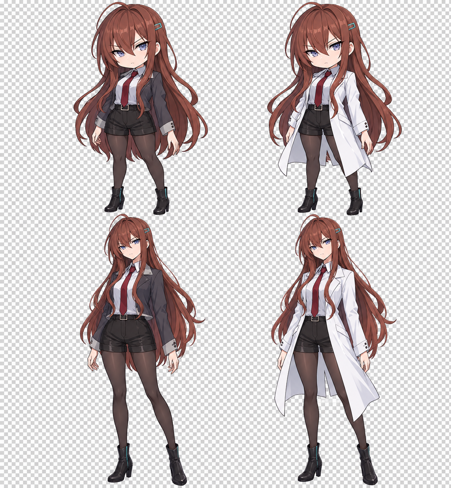

# Art Production / 美术制作

Production sources live in `pets/<id>/source/pairs/`: 33 native pose-pair images per pet, with exact prompts and reference mappings in adjacent JSON files. The four models share `animation-prompts.json` as their creative specification. Some first-pass slender Assistant drawings were reassigned to `assistant-004-anime`; their original generation records remain unchanged for provenance.

正式原图位于 `pets/<id>/source/pairs/`，每款33张双姿势原图，旁边 JSON 保存实际题词及参考图映射。四款共用 `animation-prompts.json` 创作规格。初期偏修长的 Assistant 图分配给了 `assistant-004-anime`，实际生成记录保留原貌，不重写来源。

The user explicitly approved solid green generation plus local matting on 2026-09-14. Native figures are drawn at roughly 1000-1200 pixels tall. Matting removes chroma, recovers antialiased edges, splits figures along an empty path and adds transparent padding without enlarging the drawings. Every frame uses the same 768x1536 working canvas, downsampled at 832/1536 onto a 768x832 output cell. Registration is translation only: grounded feet at one baseline, head registration for walking, and separate takeoff/apex offsets. Left movement is mirrored; all other used poses are drawn, not padded with repeated static art.

用户已同意纯绿底生成与本地抠图。人物原生高度约1000至1200像素。抠图恢复抗锯齿边缘，沿空隙分离人物，再添加透明留白，不放大人物。统一使用768x1536工作画布，按832/1536缩小到768x832输出格，只做平移配准。行走以头部为基准，跳跃单独保留蓄力、腾空与落地；左移镜像生成，其余使用姿势均为实际绘制。

## Rebuild

Use the full repository, not the lightweight install ZIP. Requires Python 3.10+, Pillow, NumPy and SciPy:

```sh
python -m pip install Pillow==11.3.0 numpy==2.2.6 scipy==1.16.3
python scripts/register_art.py pets/assistant-004
python scripts/build_pet.py pets/assistant-004 --preview
python -m unittest discover -s scripts -p 'test_*.py'
```

Repeat for the other IDs. Review outputs under `build/art-review/<id>/`. `register_art.py` deliberately resets `reviewed` to false. Only after checking every state, directions, light/dark edges, foot stability and full loops, set `reviewed: true` in `source/frames.json` and run `build_pet.py` without `--preview`. Update `assets/review.json` with the actual acceptance evidence. Rebuild indexes with `python scripts/build_index.py`; build release archives and hashes with `python scripts/build_release.py --require-hd`.

对其他角色重复以上流程。重新配准会把验收标记清零；检查全部动作、朝向、深浅底边缘、脚底和循环后才可标记已验收。不要把自动化非空像素检查等同于美术质量保证。中间透明 PNG 可重建，因此不重复提交到 Git。历史候选图片保留在本地草稿目录，不进入安装包。

## Earlier Design Drafts

The earlier images below are generated design references, **not animation assets**. Both initial drafts are RGB images with a painted checkerboard, not transparent PNG sprites. Do not install these drafts as pet sheets.

这是角色设定草稿，**不是已验收的动画素材**。目前两张图都是带绘制棋盘格的 RGB 图片，不是真透明 PNG，不能当作最终宠物图集安装或宣称高清动画已完成。



## Direction

- Two selectable characters: refined 3.5-head semi-chibi and slender 5-head anime.
- One original identity: chestnut hair, asymmetric fringe, blue-violet eyes, small teal barrette, skeptical scientist demeanor.
- Casual charcoal jacket and white scientist coat; the outfit changes with the animation state.
- Real 768x832 transparent frames, consistent full-canvas scale and registration, plus Codex v2 and v1 exports.
- User-supplied franchise reference artwork remains local and is not redistributed here.

## Generation Record

Tool: built-in `imagegen`, with solid green generation and local matting explicitly approved by the user on 2026-09-14. The earlier checkerboard drafts remain design references only. Production frames use genuine RGBA after chroma removal, with fixed canvas scaling and no image upscaling. Generation prompts and source mappings are preserved alongside the artwork.

The remaster also covers March 7th and Cirno, preserving their existing fan-art notices and signature outfits. They do not inherit Assistant-004's lab coat. Neither the original reference attachments nor franchise ownership rights are included in the code's MIT license.

### Design Sheet Prompt

Generate an ORIGINAL anime character production model sheet for Assistant-004. The supplied image is ONLY mood/color reference, NOT the character to reproduce. Invent a clearly distinct adult scientist character: chestnut-red long hair with an off-center curved fringe, two distinct tapered front locks, longer back hair to hips, a single tiny plain teal rectangular barrette on HER left, precise blue-violet eyes, subtle skeptical confident expression, NO smiley child face. Clean premium Japanese anime cel animation drawing with crisp fine dark aubergine outlines, restrained cool shadows, gorgeous eyes and individually readable hair locks, NOT pixel art, NOT 3D, NOT textured painting. Sheet has EXACTLY 4 separate full-body standing figures in equal 2 columns x2 rows, no borders or labels, ample separation. Top row: SAME character in refined semi-chibi 3.5-head proportions; left casual outfit, right white lab coat. Bottom row: SAME character in slender 5-head anime proportions; left casual outfit, right white lab coat. Casual: fitted charcoal short jacket with light gray collar worn properly on shoulders, pale collared shirt, narrow burgundy short tie, black high-waisted shorts, opaque charcoal stockings, clean black ankle boots with a tiny teal seam. Lab: same underneath plus bright white waist-to-mid-thigh split-tail scientist coat, tailored cuffs and simple lapels, no insignia. Four figures identical face/hair colors, adults with rational mature research assistant energy. All front-facing mild three-quarter view, arms relaxed, eyes forward, fixed level footing. Plain empty TRANSPARENT background with true alpha channel, no checkerboard painted in, no floor/shadows/text/logos/props, no speech bubbles. Full hair, hands and boots entirely inside each quadrant. Render at the highest native image resolution, ideally 3072x3328 or greater, not an upscaled low-res image. This is one unified character turnaround/design-reference sheet, not four separate images.

Actual output: 1205x1305 RGB. Accepted as a design reference only, not as HD frames.

### Single-Character Transparency Retry

Edit the provided character design sheet into ONE single full-body character: the TOP LEFT refined semi-chibi 3.5-head Assistant-004 in her CHARCOAL CASUAL JACKET, gray collared shirt, short burgundy tie, black tailored shorts, dark opaque stockings and ankle boots. This single image is her neutral idle animation keyframe. Precisely preserve her chestnut hair shape, single small teal hair barrette, skeptical blue-violet eyes and outfit. Face almost straight toward viewer, both boots on a level baseline, arms relaxed. Keep the entire character with 8% margin around head hair hands feet. Native canvas 768x832 or greater, high detail. IMPORTANT: remove ALL white-gray checkerboard from the reference. Return an actual RGBA PNG with alpha 0 in the empty background, not a picture of a checkerboard. No ground shadow, no pattern, no background color, no text. Actual transparency is required for a desktop sprite. Keep linework and opaque white shirt intact.

Actual output is recorded as a rejected transparency draft. Its filename is `assistant-004-casual-draft.png`.
