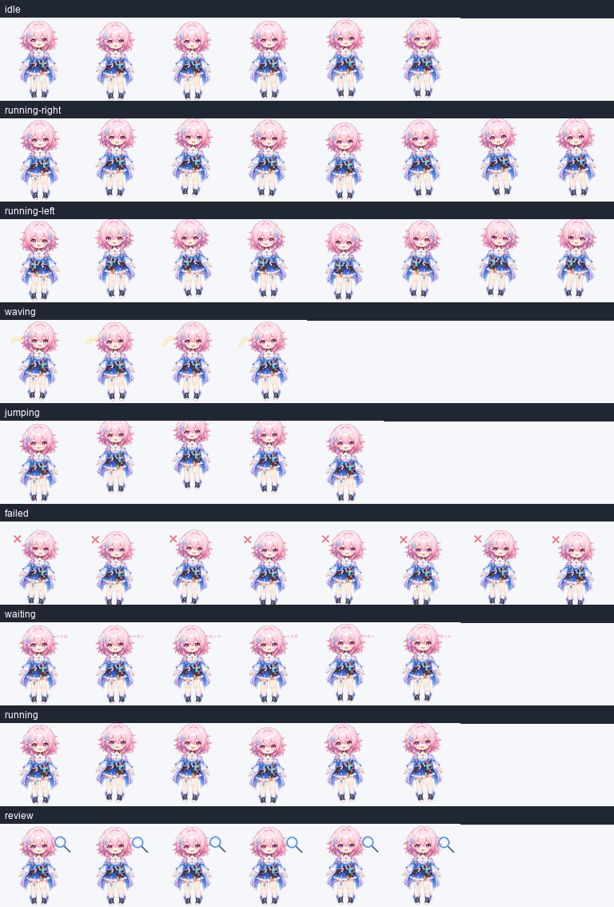

# March 7th

Fan-made Codex desktop pet of March 7th: pink-haired, cheerful, camera-carrying chibi adventurer with icy star accents.

三月七 fan-made Codex 桌面宠物：粉发、开朗、相机随身、带冰晶与星旅气质的 chibi 冒险者。



## Install / 安装

From the repository root:

```sh
python scripts/install.py --pet march-7th-001
```

Windows PowerShell:

```powershell
powershell -ExecutionPolicy Bypass -File .\scripts\install.ps1 -PetId march-7th-001
```

macOS / Linux:

```sh
./scripts/install.sh --pet march-7th-001
```

## Files / 文件

- `pet.json` - Codex pet metadata / Codex 宠物元数据
- `spritesheet.webp` - generated animated sprite atlas / 生成的动画精灵图
- `creation-prompt.md` - saved creation prompt / 保存的生成提示词
- `assets/contact-sheet.png` - visual QA contact sheet / 视觉 QA 总览图
- `assets/previews/*.gif` - per-state previews / 各状态预览

## QA Summary / 验证摘要

- Atlas size: `1536x1872`
- Cell size: `192x208`
- Format: `WEBP`, `RGBA`
- Transparent RGB residue pixels: `0`
- Frame inspection: no errors, no warnings

## Fan Notice / Fan-made 说明

March 7th and Honkai: Star Rail are associated with HoYoverse/miHoYo. This pet is an unofficial fan-made asset and is not endorsed by or affiliated with HoYoverse/miHoYo.

该条目是非官方 fan-made 素材，不代表原版权方，也未获得官方背书。
