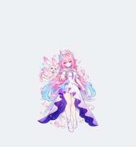

# Cyrene / 昔涟

[English collection guide](../../README.md) | [中文合集说明](../../README.zh-CN.md)

Fan-made Cyrene Codex desktop pet with pink hair, a pearl-white and star-violet dress, blue-violet roses, a memory spirit, and radiant ripple effects.

昔涟 fan-made Codex 桌面宠物：粉色长发、珍珠白与星紫礼服、蓝紫玫瑰、伴生记忆精灵和星海涟漪特效。

| Idle | Working | Greeting | Jump |
| --- | --- | --- | --- |
|  |  |  |  |

## Install / 安装

From the repository or extracted install-bundle root / 在仓库或解压后的安装包根目录运行：

```sh
python scripts/install.py --pet xilian-001
```

Windows without Python / Windows 无需 Python：

```powershell
powershell -ExecutionPolicy Bypass -File .\scripts\install.ps1 -PetId xilian-001
```

Older client: add `--legacy` or PowerShell `-Legacy`. Existing files are backed up. / 旧客户端加兼容参数，已有文件先备份。

## Assets / 素材

- `pet.json`, `spritesheet.webp`: v2, 1536x2288, 8x11 cells, 192x208 per cell.
- `compat/v1/`: v1, 1536x1872; the same nine remastered action rows.
- `hd/`: independent desktop clips, true RGBA, 768x832 frames, real-time frame durations.
- `source/pairs/`: 33 native green-screen pose pairs and adjacent `*.prompt.json` generation records.
- `source/frames.json`: shared-canvas registration; PNG intermediates regenerate with `scripts/register_art.py`.
- [Contact sheet](assets/contact-sheet.png), [validation](assets/validation.json), [review record](assets/review.json), [creation brief](creation-prompt.md).

Nine action rows plus 16 clockwise look directions. There are 73 used frames: 65 drawn frames and eight mirrored left-movement frames. Every state retains the same signature white-violet dress and exactly one memory spirit. / 九种动作与16个顺时针朝向，共73个使用帧：65个实际绘制帧与8个左移镜像帧；所有状态保留同一套白紫礼服和一只记忆精灵。

## Rights / 权利说明

Cyrene (昔涟) and Honkai: Star Rail are associated with HoYoverse/miHoYo. This pet is an unofficial fan-made asset and is not endorsed by or affiliated with HoYoverse/miHoYo.

Unofficial fan art for non-commercial personal desktop use. Underlying character and franchise rights are not granted by the code's MIT license. / 非官方同人，仅供非商业个人桌面使用；代码 MIT 协议不授予角色和作品权利。 See [NOTICE](../../NOTICE.md).
